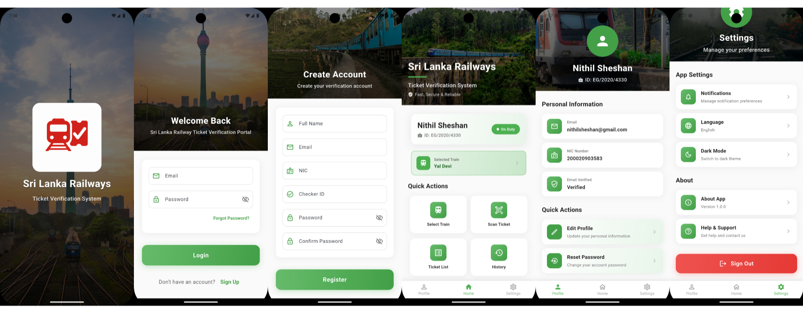
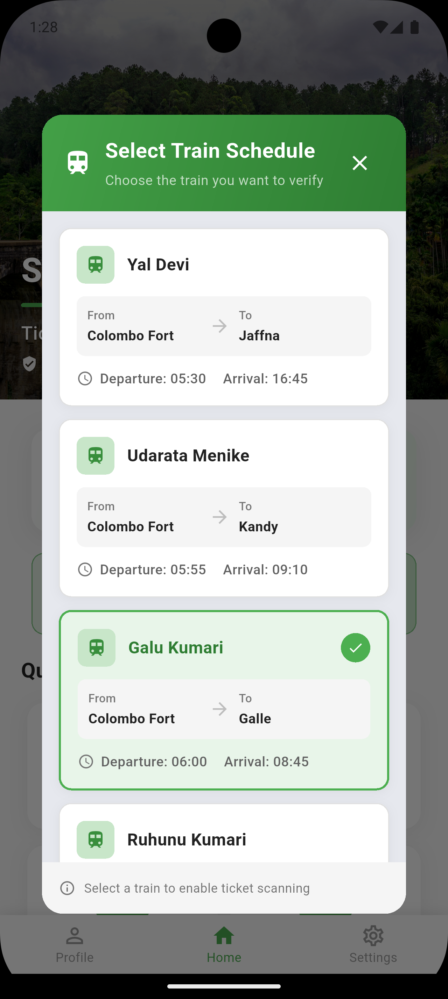
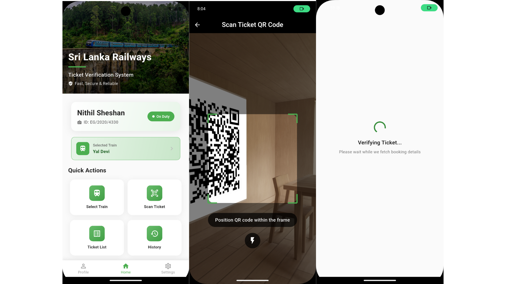
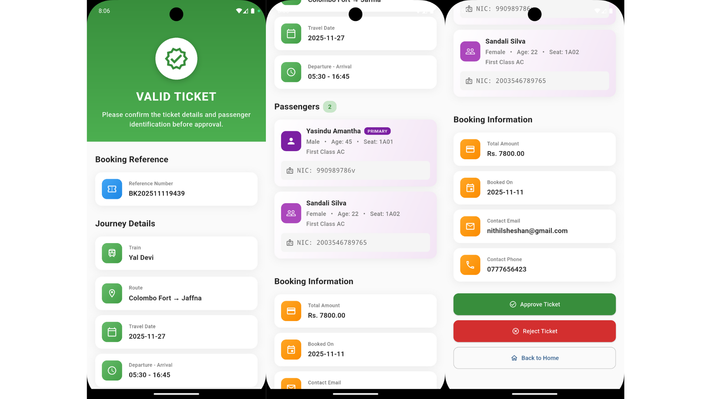
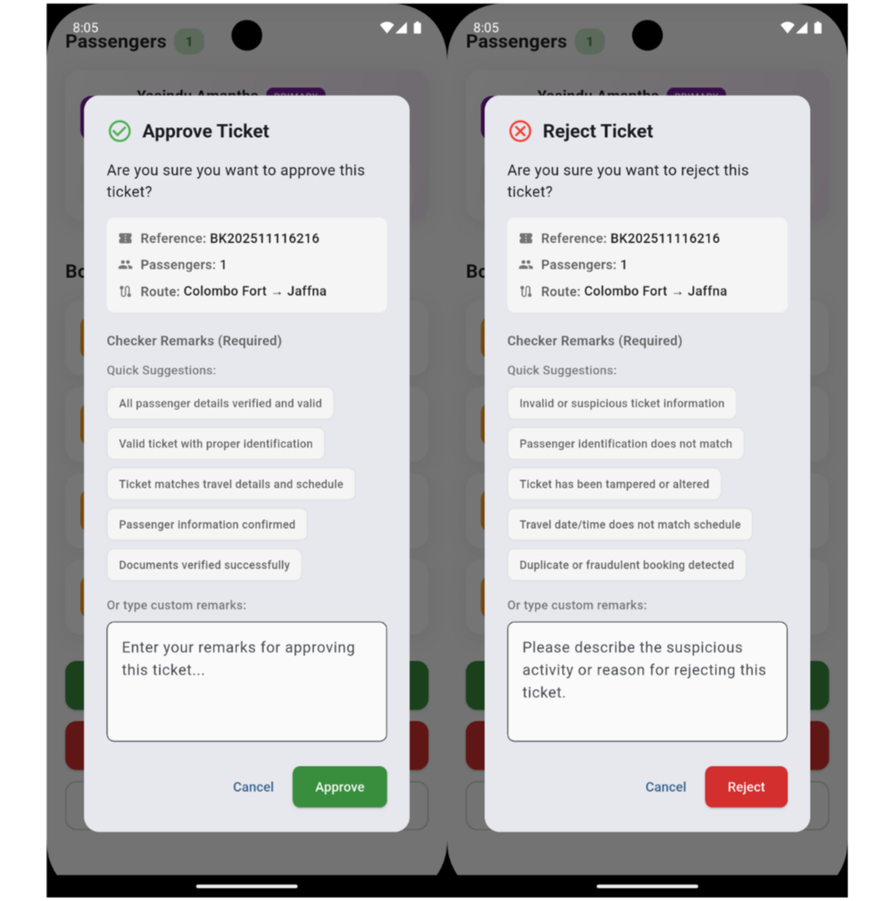
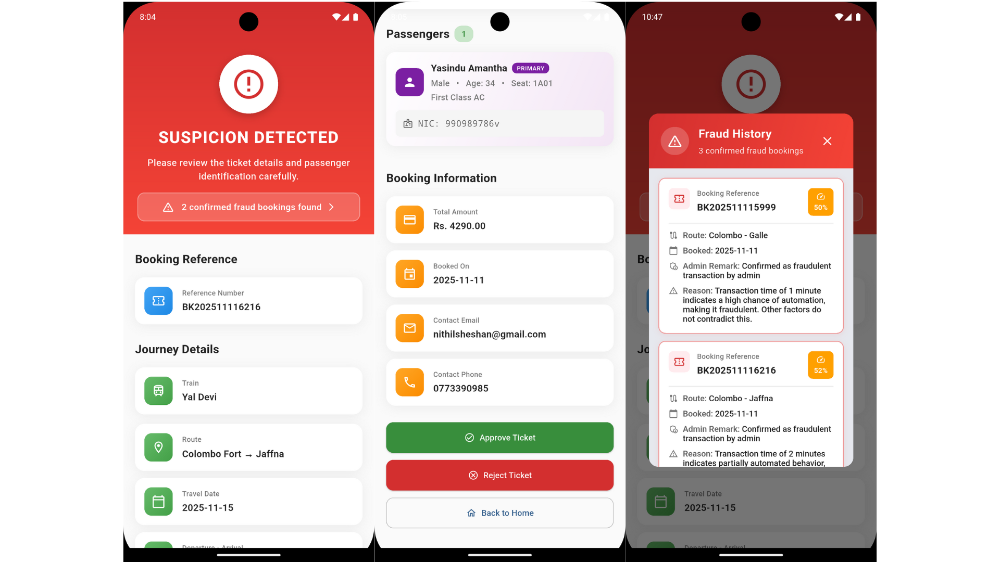
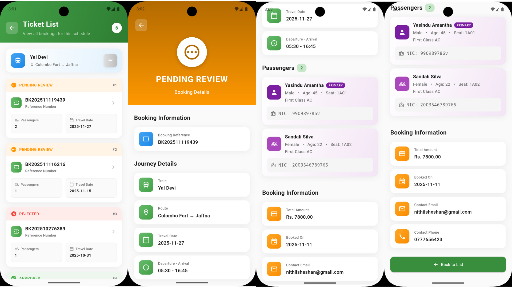
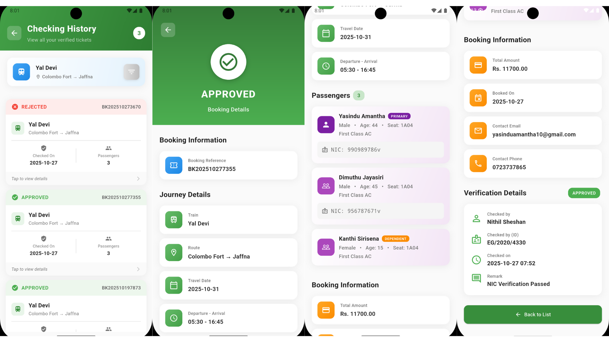

# Railway Ticket Verification App

A mobile app for railway ticket checkers to scan and verify QR tickets, make approval decisions, and maintain verification history.

## Demo

- [LinkedIn Demo Video](https://www.linkedin.com/posts/nithil-sheshan-4a3945210_flutter-dart-firebase-activity-7442473107270868992-gKJN?utm_source=share&utm_medium=member_desktop&rcm=ACoAADWIVHsBQyvJg7MFpZpjndpUXN6v4s4fnlE)

## Key Features

- Secure checker authentication
- Train schedule selection before scanning
- QR code scanning and ticket data retrieval
- Ticket approval and rejection with checker remarks
- Fraud alert display for flagged tickets
- Ticket list for selected train/date
- Checker verification history view

## Tech Stack

- Flutter (Dart)
- Provider (state management)
- Firebase Authentication
- Cloud Firestore
- PostgreSQL
- mobile_scanner
- permission_handler
- shared_preferences

## Architecture (Simple)

Feature-first + layered structure:

- UI (screens/widgets)
- Controllers (state and flow)
- Repositories (data operations)
- Services (Firebase, PostgreSQL, permissions, local storage)

## Screenshots

### 1. Login Procedure and Home Screen


### 2. Train Selection


### 3. QR Scanning


### 4. Ticket Details Displayed After Successful Retrieval


### 5. Ticket Approval and Rejection Interface


### 6. Fraud Alert Notification Displayed for a Flagged Ticket


### 7. Ticket List for Selected Train and Date


### 8. Checker Verification History Screen


## Quick Run

```bash
flutter pub get
flutter run
```
